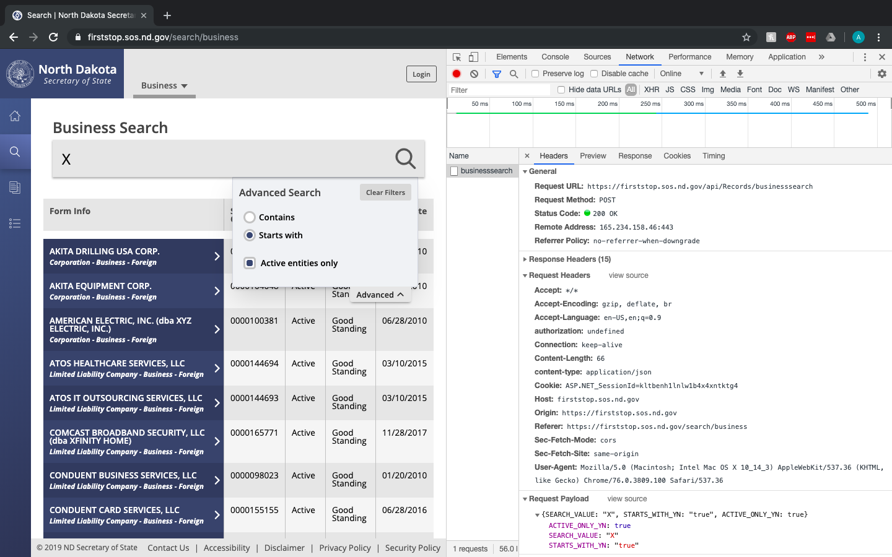
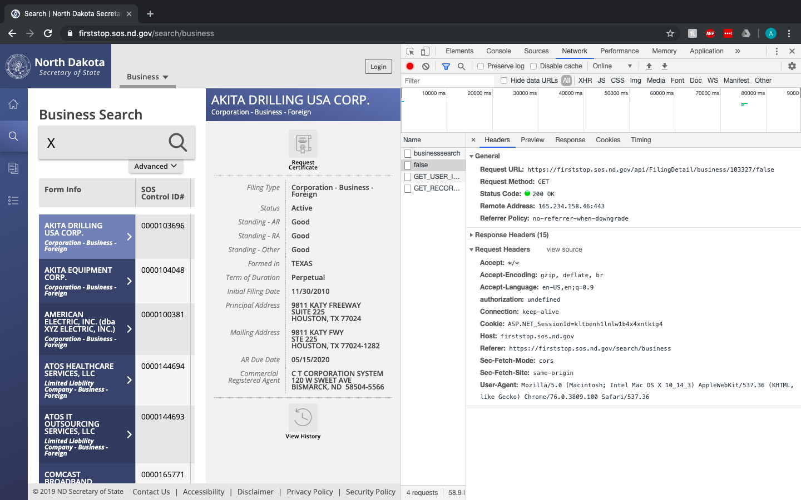

# WebApp Entity Resolution
__Task__: From [the North Dakota SOS's public webapp](https://firststop.sos.nd.gov/search/business), download information for all active companies whose names start with the letter "X" including their Commercial Registered Agent, Registered Agent, and/or Owners. Then visualize the enities and any shared attributes among them.

__Solution__: 
1. [crawler.py](./crawler.py): A scrapy script which crawls the webapp and saves revelant data to [crawler-entity-data.json](./crawler-entity-data.json).
2. [graph.py](./graph.py): A python script to generate a NetworkX graph of the entity data from the crawler.

## Data Retrieval

Upon first analysis of the web application, my plan was to scrape the static html of the site for the business entity data generated from using the search functionality. However, after noticing that the webpage's url did not change when submitting search requests it was likely that the search results were being generated dynamically. Thus, a simple webscraping library such as Scrapy would not be able to interact with that dynamic web-data.

I confirmed this by using my browser development tools to see that the page is blank when disabling Javascript.

I then thought of two approaches to overcome this:
1. Use a browser emulation library for Python to render the Javascript (Splash, Selenium, etc..)

2. Try to reverse engineer the flow of data in the webapp and see if any public API calls are used to retrieve the search results. Then call those APIs directly for the required entity data.

While Solution #1 might fit a wider variety of scenarios when scraping web-data, it normally requires a lot more overhead and configuration. For example, the sparky-splash library for python requires the running of a "Splash Server" to render Javascript client-side (similar to Javascript running in your browser). Additionally, once rendering the Javascript correctly the right combination of button clicks and DOM manipulation must be invoked to recreate the search experience of the webapp. This is great for testing user functionality of a application, not so much for automated data retrieval.

After inspecting the "Network" Tab in my browser development tools, I could clearly see that everytime I submitted a search request a client-side call to the following API: ```https://firststop.sos.nd.gov/api/Records/businesssearch``` was made. Looking at this request's response I could see that this was what was being used to generate the search results table dyanmically. From the same tab, I got all of the elements necessary for calling this API from outside the browser such as Request Method, Headers, and the necessary Body Parameters to generate a request that would retrieve all active businesses that start with 'X'. Using the same logic, I found the API call that gets further business data () for a given entity: ```https://firststop.sos.nd.gov/api/FilingDetail/business/<entity_id>/false``` which is called when you expand a given search result in the table on the webapp. <entity_id> is a identifer value given in the results of the first API call and false appears to be a value based off if the client-side user of the webapp is logged in and is the respective owner of the selected business. Below is the network tab illustrated:




I double checked that the two API calls worked outside my browser, using [postman](https://www.getpostman.com/). Upon successfully getting the necessary data back, I knew I was good to create python scripts to automate data retrieval.

## Data Presentation

The data is respresented in two formats:
1. [crawler-entity-data.json](./crawler-entity-data.json): a json formatted list of entities extracted by the crawler.py scrapy script. For each entity within our search parameters we save the __entity name, commercial registered agent, registered agent, and/or owners__. Any missing data is respresented by "null".

2. [entity-resolution-graph.png](./entity-resolution-graph.png): A graphviz/mathplotlib visualization of the networkX graph created in the graph.py script. Each node of the graph is entity. Any edges between nodes in the graph indicate that those nodes share the same Commercial Registered Agent, Registered Agent,and/or Owners. The graph is illustrated below:


## Recreation

### Environment setup
__Note__: Scrapy and matplotlob require a lot of dependencies and system-level packages. If you want a fully containerized of this code, I recommend using the docker image I created for this project:
```
# Recommended (with docker installed)
docker pull arturofc/entity-resolution
# or build image locally
docker build -t arturofc/entity-resolution .

# Alternative (from virtualenv)
pip install -r requirements.txt
```

### Retrieve Entity Data
```
# using docker
docker run -it --entrypoint '/usr/local/bin/scrapy' -v $(pwd)/:/code arturofc/entity-resolution runspider crawler.py -o crawler-entity-data.json

# if you somehow managed to pip install that huge requirements.txt file
scrapy runspider crawler.py 
```

### Generate Graph Visualization
```
# docker 
docker run -it --entrypoint '/usr/local/bin/python' -v $(pwd)/:/code arturofc/entity-resolution graph.py

# alternative
python graph.py
```